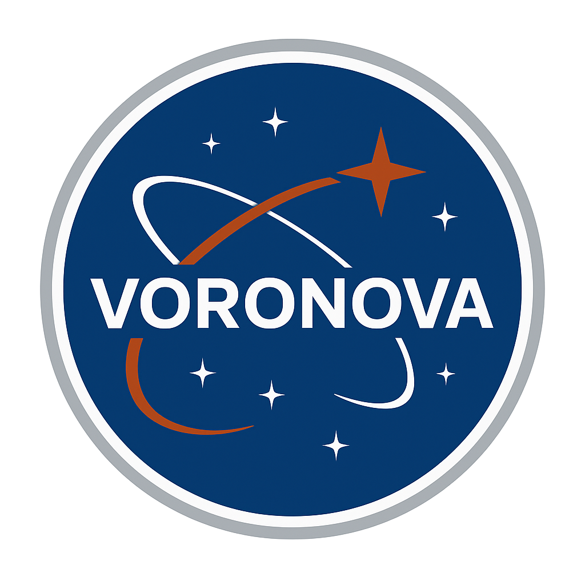

# 🚀 Voronova - AI-Powered Space Habitat Designer

<div align="center">
  
  
  **Advanced AI-powered tools designed for students and engineering professionals**

[](https://vercel.com/ahadathars-projects/v0-voronova-landing-page)
[](https://v0.app/chat/projects/GmAbvmNhHXV)
  [](https://nextjs.org/)
  [](https://reactjs.org/)
  [](https://www.typescriptlang.org/)
</div>

---

## 📋 Table of Contents

- [Overview](#-overview)
- [Features](#-features)
- [Tech Stack](#-tech-stack)
- [Getting Started](#-getting-started)
- [Project Structure](#-project-structure)
- [Pages & Components](#-pages--components)
- [Deployment](#-deployment)
- [Contributing](#-contributing)
- [License](#-license)

---

## 🌟 Overview

**Voronova** is an innovative AI-powered space habitat design platform that empowers students, engineers, and space enthusiasts to create and optimize space habitat designs. Built with cutting-edge web technologies, Voronova combines artificial intelligence with intuitive user interfaces to make space engineering accessible to everyone.

### 🎯 Mission
To democratize space habitat design by providing intelligent tools that transform complex engineering challenges into innovative, space-ready solutions.

### 🚀 Vision
Empowering the next generation of space explorers with AI-driven design tools that make space habitat engineering accessible, educational, and inspiring.

---

## ✨ Features

### 🤖 AI-Driven Design
- **Generative AI**: Creates floor plans and 3D models based on user inputs
- **Real-time Optimization**: AI-powered suggestions for habitat improvements
- **Design Analysis**: Comprehensive metrics including efficiency, safety, and cost optimization

### 🎨 Interactive Visualization
- **2D/3D Views**: Switch between different visualization modes
- **Orbital Animations**: Beautiful space-themed animations and effects
- **Real-time Updates**: See changes instantly as you modify designs

### 🛠️ Design Tools
- **Habitat Features**: Toggle waste management, plant growth, solar panels, living quarters
- **Parameter Controls**: Adjust scale factors and complexity levels
- **Annotation Tools**: Pencil, ruler, move, and resize tools for design modification

### 📊 Analysis Dashboard
- **Design Metrics**: Efficiency score, safety rating, cost optimization
- **AI Suggestions**: Intelligent recommendations for design improvements
- **Before/After Comparison**: Visual comparison of original vs optimized designs

### 🎓 Educational Focus
- **Student-Friendly**: Accessible interface for learners of all ages
- **Professional Tools**: Advanced features for engineering professionals
- **Resource Library**: Space station guides, Mars habitat blueprints, engineering standards

---

## 🛠️ Tech Stack

### Frontend
- **Framework**: Next.js 15 with React 19
- **Language**: TypeScript
- **Styling**: Tailwind CSS v4 with custom animations
- **UI Components**: Radix UI with shadcn/ui
- **Icons**: Lucide React
- **Fonts**: Geist Sans & Mono

### Backend & Deployment
- **Platform**: Vercel
- **Analytics**: Vercel Analytics
- **Build Tool**: Webpack
- **Package Manager**: npm

### Development Tools
- **Code Quality**: ESLint, TypeScript strict mode
- **Styling**: PostCSS, Autoprefixer
- **Animation**: tw-animate-css, custom CSS animations

---

## 🚀 Getting Started

### Prerequisites
- Node.js 18+ 
- npm or yarn
- Git

### Installation

1. **Clone the repository**
   ```bash
   git clone https://github.com/your-username/voronova-landing-page.git
   cd voronova-landing-page
   ```

2. **Install dependencies**
   ```bash
   npm install
   # or
   yarn install
   ```

3. **Run the development server**
   ```bash
   npm run dev
   # or
   yarn dev
   ```

4. **Open your browser**
   Navigate to [http://localhost:3000](http://localhost:3000)

### Build for Production

```bash
npm run build
npm start
```

---

## 📁 Project Structure

```
v0-voronova-landing-page-main/
├── app/                          # Next.js App Router
│   ├── page.tsx                 # Main landing page
│   ├── app/page.tsx             # Interactive design app
│   ├── results/page.tsx         # Analysis results page
│   ├── layout.tsx               # Root layout
│   └── globals.css              # Global styles
├── components/                   # React components
│   ├── ui/                      # Reusable UI components
│   │   ├── button.tsx
│   │   ├── card.tsx
│   │   ├── input.tsx
│   │   └── ...
│   ├── hero.tsx                 # Landing page hero section
│   ├── features.tsx             # Features showcase
│   ├── navigation.tsx           # Site navigation
│   ├── loading-screen.tsx       # Animated loading screen
│   ├── orbit-system.tsx         # Orbital animation
│   └── ...
├── lib/                         # Utilities
│   └── utils.ts                 # Helper functions
├── public/                      # Static assets
│   ├── logo.png
│   ├── placeholder-*.jpg
│   └── ...
├── styles/                      # Additional styles
├── components.json              # shadcn/ui configuration
├── next.config.mjs             # Next.js configuration
├── package.json                 # Dependencies
├── tsconfig.json               # TypeScript configuration
└── README.md                   # This file
```

---

## 📄 Pages & Components

### 🏠 Landing Page (`/`)
- **Hero Section**: Animated orbital system with logo
- **Features**: AI-driven design, instant visualization, safety & reliability
- **How It Works**: 3-step process explanation
- **Call-to-Action**: Get started and demo buttons

### 🎨 Prompt Now Page (`/app`)
- **AI Chat Interface**: Real-time conversation with habitat design assistant
- **Interactive Visualization**: 2D/3D habitat visualization
- **Design Controls**: Feature toggles and parameter adjustments
- **Resource Library**: Space station guides and templates

### 📊 Results Page (`/results`)
- **Design Analysis**: AI-powered optimization suggestions
- **Image Upload**: Upload and analyze habitat designs
- **Metrics Dashboard**: Efficiency, safety, and cost scores
- **Comparison View**: Before/after design comparison

### 🧩 Key Components
- **LoadingScreen**: Animated loading with orbital mechanics
- **OrbitSystem**: Central planet with orbiting elements
- **StarField**: Background star animation
- **Navigation**: Responsive navigation with mobile menu

---

## 🚀 Deployment

### Vercel Deployment
This project is automatically deployed on Vercel and synced with v0.app:

**Live URL**: [https://vercel.com/ahadathars-projects/v0-voronova-landing-page](https://vercel.com/ahadathars-projects/v0-voronova-landing-page)

### Manual Deployment
1. **Build the project**
   ```bash
   npm run build
   ```

2. **Deploy to Vercel**
   ```bash
   npx vercel
   ```

3. **Or deploy to other platforms**
   - Netlify
   - AWS Amplify
   - Railway
   - Render

---

## 🎨 Design System

### Color Palette
- **Primary**: Orange (`oklch(0.55 0.18 35)`) - NASA-inspired
- **Background**: Deep space blue-black (`oklch(0.12 0.02 250)`)
- **Secondary**: Deep blue (`oklch(0.35 0.15 250)`)
- **Accent**: Orange gradient variations

### Typography
- **Primary Font**: Geist Sans
- **Monospace**: Geist Mono
- **Responsive**: Mobile-first approach

### Animations
- **Orbital Motion**: Spinning rings with orbiting elements
- **Star Twinkling**: Random star field animation
- **Color Loading**: Letter-by-letter color transitions
- **Smooth Transitions**: 300ms ease-in-out animations

---

## 🤝 Contributing

We welcome contributions! Here's how you can help:

### 🐛 Bug Reports
- Use GitHub Issues to report bugs
- Include steps to reproduce
- Provide system information

### 💡 Feature Requests
- Suggest new features via GitHub Issues
- Describe the use case and benefits
- Consider implementation complexity

### 🔧 Code Contributions
1. Fork the repository
2. Create a feature branch (`git checkout -b feature/amazing-feature`)
3. Commit your changes (`git commit -m 'Add amazing feature'`)
4. Push to the branch (`git push origin feature/amazing-feature`)
5. Open a Pull Request

### 📝 Documentation
- Improve README sections
- Add code comments
- Create tutorials or guides

---

## 📚 Learning Resources

### Space Habitat Design
- [NASA Space Station Design Guidelines](https://www.nasa.gov/)
- [Mars Habitat Research](https://www.nasa.gov/topics/moon-to-mars/)
- [International Space Station](https://www.nasa.gov/mission_pages/station/)

### Web Development
- [Next.js Documentation](https://nextjs.org/docs)
- [React Documentation](https://react.dev/)
- [Tailwind CSS](https://tailwindcss.com/docs)
- [TypeScript Handbook](https://www.typescriptlang.org/docs/)

---

## 📄 License

This project is licensed under the MIT License - see the [LICENSE](LICENSE) file for details.

---

## 🙏 Acknowledgments

- **NASA** for space exploration inspiration
- **Vercel** for hosting and deployment platform
- **v0.app** for AI-powered development tools
- **Open Source Community** for amazing libraries and tools

---

## 📞 Contact

- **Project Maintainer**: [Your Name]
- **Email**: [your.email@example.com]
- **GitHub**: [@yourusername](https://github.com/yourusername)
- **LinkedIn**: [Your LinkedIn](https://linkedin.com/in/yourprofile)

---

<div align="center">
  <p>Made with ❤️ for the future of space exploration</p>
  <p>⭐ Star this repository if you found it helpful!</p>
</div>