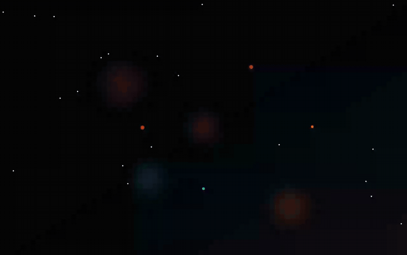
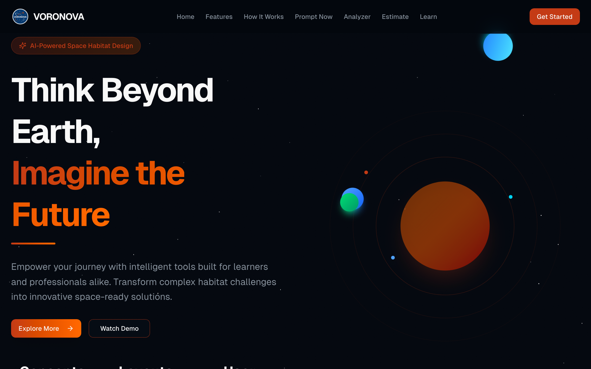
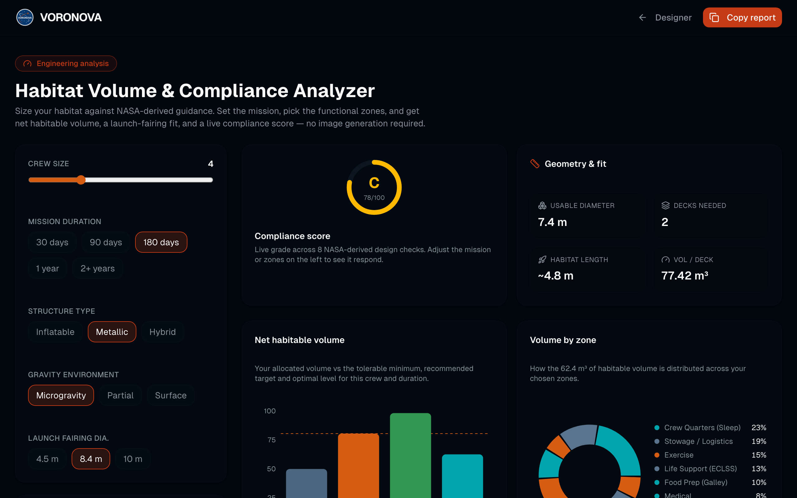
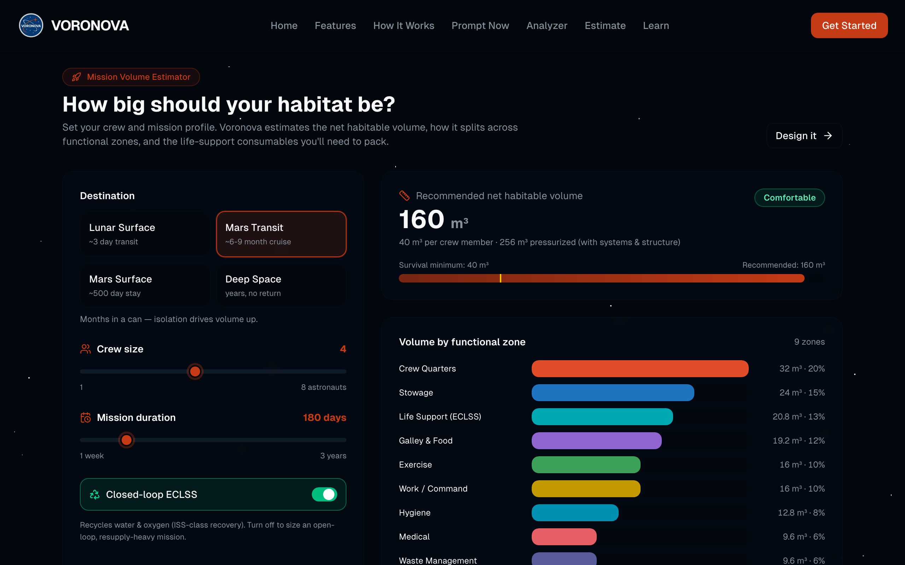
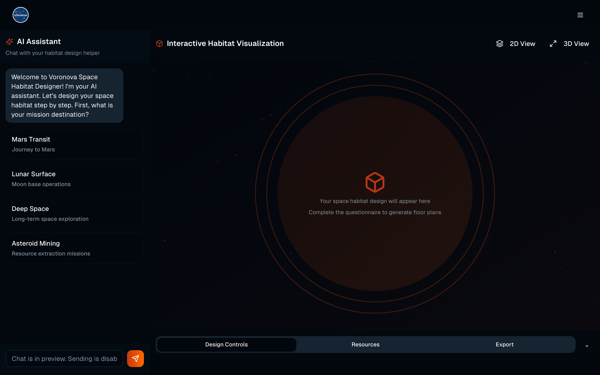
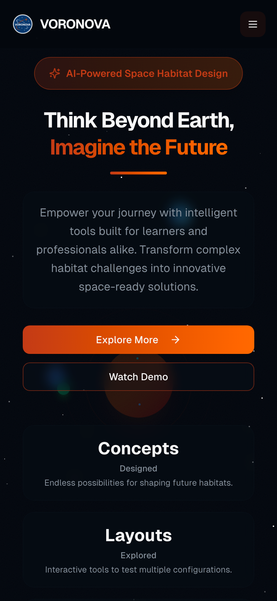

<div align="center">
  

  # 🚀 Voronova

  ### Design habitats for the final frontier — no rocket science degree required.

  Turn a plain-language mission brief into real **2D floor plans, 3D layouts, and NASA-grade
  volume math** for the Moon, Mars, and the long dark in between.

  <br/>

  
  
  
  
  
  

  <br/>

  ### 🌍 **[Launch the live app → habitat.waleeds.world](https://habitat.waleeds.world)**

</div>

<br/>

<div align="center">
  
  <br/>
  <em>From a starry landing to a graded habitat in under a minute. No spacesuit required.</em>
</div>

---

## 🌌 What is this?

**Voronova** is a web app that turns a plain-language brief — *"a four-crew habitat for a Mars
transit"* — into an inspectable, editable space habitat. You describe the mission, pick the zones
you need (sleep, hygiene, life support, plant growth, exercise…), and Voronova generates the layout
**and** checks it against NASA-derived design rules.

It was born during a NASA Space Apps push, where the challenge was simple to say and hard to do:
*make space habitat design something a curious 12-year-old and a seasoned systems engineer can both
enjoy.* Voronova is our answer — one interface, two doors: a friendly **"For Everyone"** guide and a
rigorous **"Professional"** mode. Houston, we have a solution.

---

## ✨ What's new in this release

This iteration was a full crew of upgrades. Highlights:

| 🆕 Feature | What it does |
| --- | --- |
| **🧮 Habitat Volume & Compliance Analyzer** (`/analyzer`) | Size any habitat against NASA-derived guidance: net habitable volume, launch-fairing fit, decks needed, and a **live compliance score across 8 design checks** — with a volume-by-zone donut that updates as you tweak crew, duration and structure. No image generation required. |
| **📏 Mission Volume Estimator** (`/estimate`) | *"How big should my can be?"* Pick a destination, crew size, mission length and whether ECLSS is closed-loop — get the **recommended net habitable volume**, per-zone breakdown, and consumables you'd need to pack. |
| **🅰️/🅱️ A/B hero variant** | The landing hero ships in two flavours. Default `/` is variant **A**; `/?variant=b` swaps in the **"Mission Control"** hero. See [`docs/VARIANTS.md`](docs/VARIANTS.md). |
| **💅 UI polish layer** | Glassy cards, scroll-progress bar, animated footer, nebula glows, brand-gradient titles, scroll-reveal sections and a richer Learn hub. |
| **🛡️ Robustness hardening** | Mobile overflow guards, a keyboard-friendly mobile menu (Esc-to-close, background-scroll lock, auto-close on resize) and **API timeouts** so a stalled backend never freezes the UI. |
| **♿ Accessibility + performance** | Respects `prefers-reduced-motion`, adds a skip-link, landmarks and visible focus rings, code-splits the guide modal, and **shrank the logo 1.15 MB → 67 KB**. |
| **🔎 SEO / social** | Open Graph + Twitter cards, JSON-LD, `sitemap.xml`, `robots.txt`, a web manifest and a full favicon set. |
| **🧪 Tests + CI** | 26 unit tests (Vitest), a Playwright e2e smoke suite, and a GitHub Actions workflow that runs them on every push. |

---

## 📸 Screenshots

<div align="center">
  
  <br/><em>Landing — animated starfield, orbit system and the new Analyzer / Estimate nav.</em>
  <br/><br/>
  
  <br/><em>🆕 Habitat Volume & Compliance Analyzer — live grade across 8 NASA-derived checks.</em>
  <br/><br/>
  
  <br/><em>🆕 Mission Volume Estimator — how big your can needs to be, zone by zone.</em>
  <br/><br/>
  <table>
    <tr>
      <td align="center"><br/><em>Designer — AI flow + 2D/3D views</em></td>
      <td align="center" width="30%"><br/><em>Fully responsive</em></td>
    </tr>
  </table>
</div>

---

## 🚀 Quick start (beginner-friendly)

You'll need [Node.js](https://nodejs.org) 18+ and npm. That's it — no launch pad.

```bash
# 1. Clone the repo
git clone https://github.com/waleedsworld/NASA-PROJECT.git
cd NASA-PROJECT

# 2. Install dependencies
npm install

# 3. Blast off (dev server)
npm run dev
```

Now open **[http://localhost:3000](http://localhost:3000)** in your browser. *(If port 3000 is
already occupied, Next.js quietly moves you to 3001 — check the terminal.)*

### 🛰️ Explore the new tools

Once it's running, take the grand tour:

| Route | What you'll find |
| --- | --- |
| `/` | The animated landing page (try `/?variant=b` for the Mission Control hero) |
| `/app` | The interactive habitat **Designer** with the AI assistant flow |
| `/analyzer` | 🆕 The **Compliance Analyzer** — live volume math + design grade |
| `/estimate` | 🆕 The **Volume Estimator** — how big should your habitat be? |
| `/learn` | The Learn hub — "For Everyone" and "Professional" guides |

### 🏗️ Build for production

```bash
npm run build      # static export → dist/
npm run serve:dist # preview the export locally on :8234
```

Voronova is a **fully static export** (`output: 'export'`), so the `dist/` folder drops onto any
static host — GitHub Pages, Cloudflare Pages, Netlify, an S3 bucket, or a potato with nginx.

### 🧪 Run the tests

```bash
npm run test       # unit tests (Vitest)
npm run test:e2e   # end-to-end smoke tests (Playwright)
```

---

## 🧰 Tech stack

- **Framework:** Next.js 15 (App Router, static export) + React 19
- **Language:** TypeScript 5
- **Styling:** Tailwind CSS v4 with a custom OKLCH space theme
- **UI:** Radix UI / shadcn primitives, Lucide icons, Recharts for the analyzer visuals
- **Testing:** Vitest (unit) + Playwright (e2e), wired into GitHub Actions

---

## 🗺️ Project structure

```
app/            App Router routes (/, /app, /analyzer, /estimate, /learn, /results)
components/     UI components (hero, navigation, footer, starfield, orbit-system…)
lib/            Logic: api client, habitat-analysis, mission-estimator, plan-helpers
public/         Logo, favicons, sample floor plans, OG image
docs/           VARIANTS.md and demo media
tests/          Vitest unit specs + Playwright e2e smoke
```

---

## 🤝 Contributing

Found a bug, or have an idea to make off-world living a little roomier? Open an issue or a PR — we
read every transmission. Please run `npm run test` and `npm run build` before you send it our way.

---

## 📜 License

MIT. Build habitats, learn things, reach for the stars. 🌠

<div align="center">
  <br/>
  <sub>Built with ☕ and cosmic curiosity by <a href="https://github.com/waleedsworld">Waleed Ajmal</a> · Live at <a href="https://habitat.waleeds.world">habitat.waleeds.world</a></sub>
</div>
