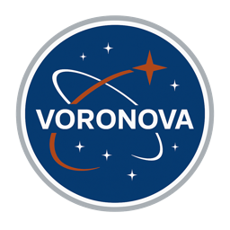
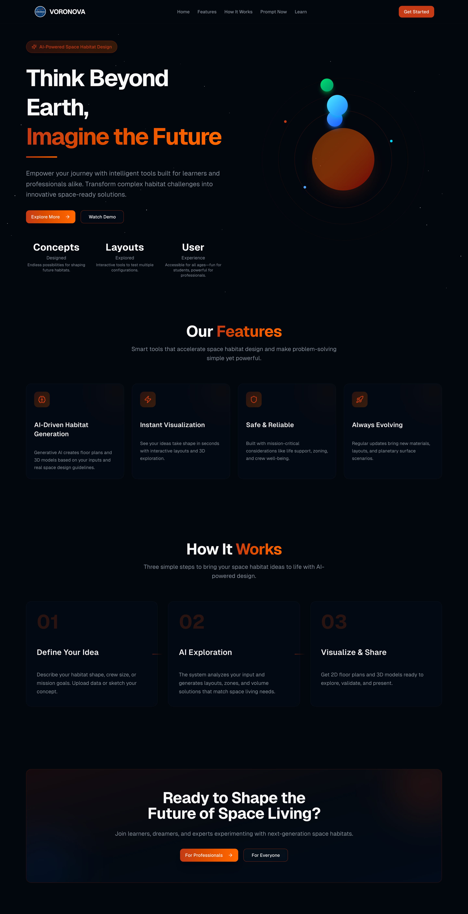
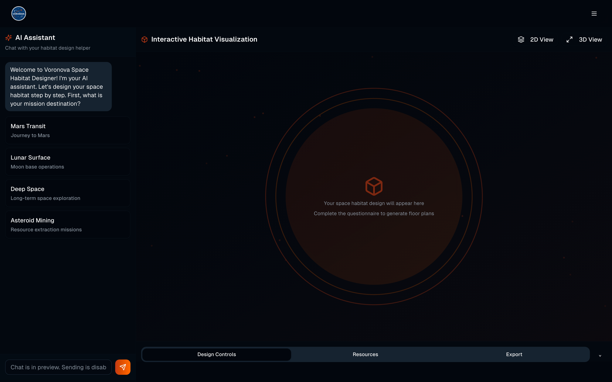
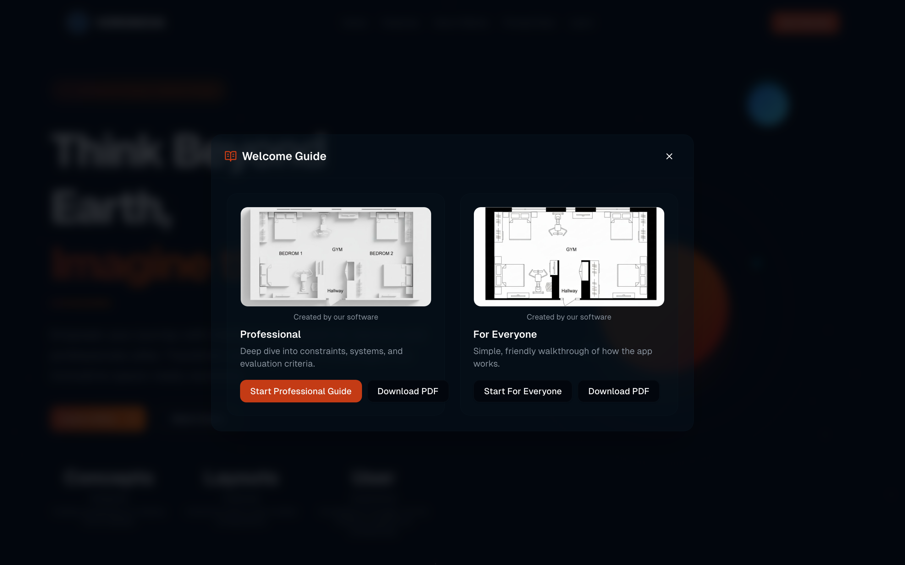
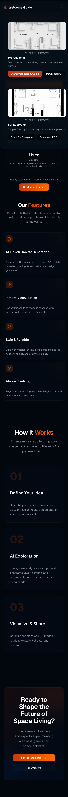
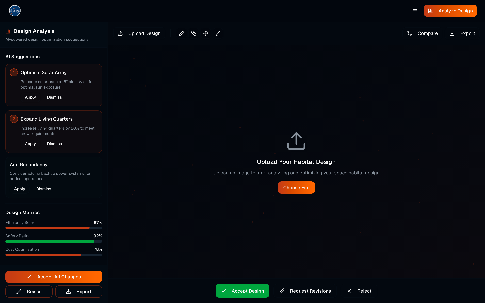
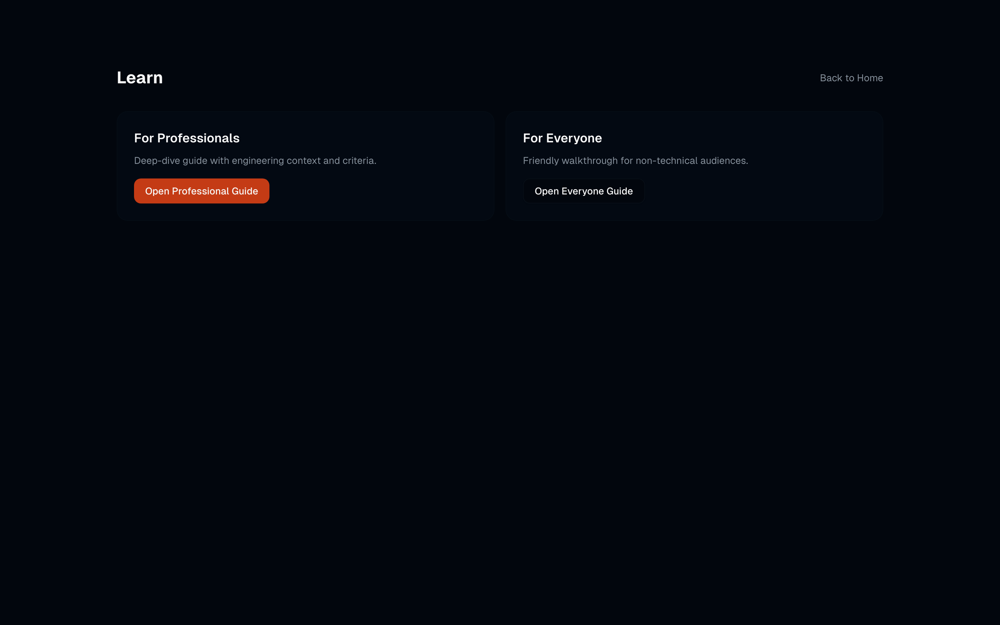

<div align="center">
  

  # 🚀 Voronova

  ### AI-powered space habitat designer — think beyond Earth, imagine the future.

  Design, visualize, and optimize living spaces for the Moon, Mars, and the long dark in between.
  Built for students, dreamers, and engineering pros alike.

  <br/>

  
  
  
  
</div>

---

## 🌌 What is this?

**Voronova** is a web app that turns a plain-language brief — *"a four-crew habitat for a Mars transit"* —
into real **2D floor plans and 3D layouts**. You describe the mission, pick the zones you need
(sleep, hygiene, life support, plant growth, exercise…), and the AI generates a habitat you can
inspect, edit, and export.

It was born during a NASA Space Apps push, where the challenge was simple to say and hard to do:
*make space habitat design something a curious 12-year-old and a seasoned systems engineer can
both enjoy.* Voronova is our answer — one interface, two doors: a friendly **"For Everyone"** guide
and a **"Professional"** deep dive.

<div align="center">
  
</div>

---

## ✨ Features

- 🪐 **Prompt-to-habitat** — describe a mission destination and crew, get generated floor plans back.
- 🧊 **2D / 3D visualization** — flip between a top-down plan and a spatial view of the same design.
- 🛠️ **Zone controls** — toggle life support, waste management, plant growth, living quarters, and more.
- 🤖 **AI assistant chat** — a step-by-step conversation that walks you from idea to layout.
- 📊 **Results & analysis** — upload a design and get optimization suggestions and metrics.
- 📚 **Learn hub** — a Welcome Guide plus downloadable PDFs (a friendly "Kid Nova" guide and a deeper "PhD" one).
- 📱 **Fully responsive** — the orbit spins just as nicely on a phone as on a 4K monitor.
- 🌠 **Space-native design** — animated starfield, orbital hero, and a NASA-inspired orange-on-deep-blue palette.

<div align="center">
  
  <br/><em>The interactive designer — pick a mission, chat with the assistant, watch the habitat take shape.</em>
</div>

---

## 🖼️ A quick tour

| The Welcome Guide | On mobile |
| :---: | :---: |
|  |  |

| Results & analysis | Learn hub |
| :---: | :---: |
|  |  |

---

## 🧑‍🚀 Getting started (zero assumptions)

You'll need **Node.js 18 or newer** and **npm**. That's genuinely it. Check what you've got:

```bash
node -v   # should print v18.x or higher
npm -v
```

Don't have Node? Grab it from [nodejs.org](https://nodejs.org/) (the LTS build is perfect).

### 1. Clone and enter the launchpad

```bash
git clone https://github.com/waleedsworld/NASA-PROJECT.git
cd NASA-PROJECT
```

### 2. Install the dependencies

```bash
npm install
```

Go stretch — this pulls Next.js, React 19, Radix UI, and friends. First install takes a minute or two.

### 3. Light the engines (dev server)

```bash
npm run dev
```

Open [http://localhost:3000](http://localhost:3000) and you're in orbit. 🌍

### 4. Build for launch (production)

Voronova is configured as a **fully static export**, so it deploys anywhere that serves files:

```bash
npm run build      # outputs a static site to ./dist
```

Then serve `./dist` with any static host (Cloudflare Pages, Netlify, GitHub Pages, or a quick
`npx serve dist` for a local peek).

---

## 🔌 The design API

The floor-plan generation is powered by a small backend defined in [`lib/api.ts`](./lib/api.ts).
By default it points at the project's hosted endpoint:

```ts
const API_BASE_URL = 'https://plangen.waleeds.world'
```

It exposes three friendly calls: `createFloorPlan()`, `editFloorPlan()`, and `healthCheck()`.
Running your own generator? Just swap that base URL and the app talks to yours instead.

> ℹ️ **Heads up:** the live generator runs on modest cloud credits, so uptime can wobble. The UI
> shows a gentle banner when that happens — no crashed rockets, just an occasional coffee break.

---

## 🗺️ Project structure

```
NASA-PROJECT/
├── app/                      # Next.js App Router
│   ├── page.tsx              # 🏠 Landing page (hero, features, how-it-works)
│   ├── app/page.tsx          # 🎨 The interactive habitat designer
│   ├── results/page.tsx      # 📊 Analysis & optimization results
│   ├── learn/page.tsx        # 📚 Learn hub
│   ├── layout.tsx            # Root layout + metadata
│   └── globals.css           # Space-theme design tokens
├── components/               # Hero, orbit-system, star-field, navigation,
│   │                         #   guide-modal, video-modal, loading-screen…
│   └── ui/                   # shadcn/ui primitives (button, card, tabs…)
├── lib/
│   ├── api.ts                # Floor-plan generation client
│   └── utils.ts              # Helpers
├── public/                   # Logo, sample floor plans, guide PDFs, demo video
└── next.config.mjs           # Static export config
```

---

## 🛠️ Tech stack

- **Framework:** Next.js 15 (App Router, static export) + React 19
- **Language:** TypeScript
- **Styling:** Tailwind CSS v4 with custom oklch space tokens + `tw-animate-css`
- **UI:** Radix UI primitives via shadcn/ui, Lucide icons
- **Fonts:** Geist Sans & Geist Mono

---

## 🌍 Live demo

**Deploying soon** — the static build is ready to fly; we're just picking a launch pad. ⏳

---

## 🤝 Contributing

Ideas, bug reports, and pull requests are all welcome. Fork it, branch it (`feat/your-idea`),
commit, and open a PR. Space is a team sport.

---

## 📄 License

Released under the MIT License.

<div align="center">
  <br/>
  <em>Made with ❤️ and a healthy disregard for the atmosphere.</em>
</div>
